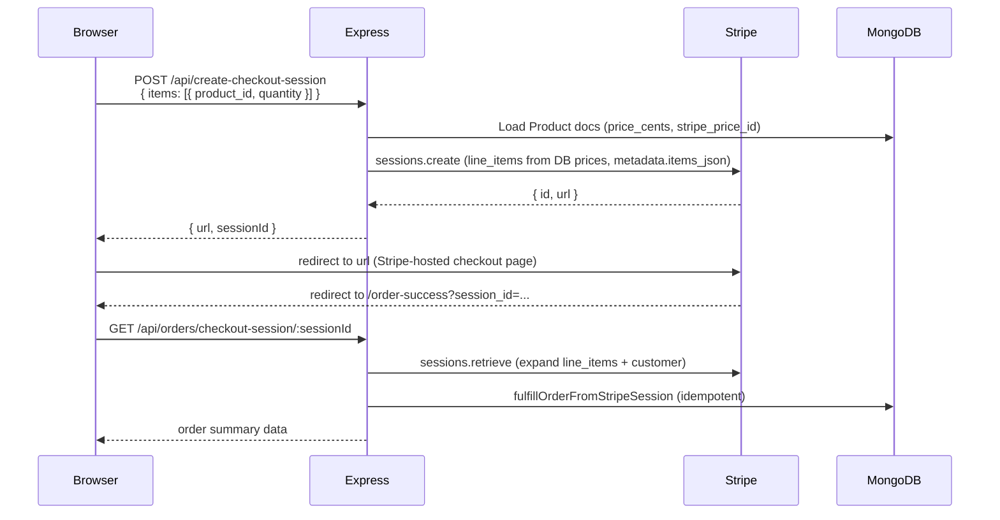

# Architecture

Artist portfolio storefront built as a monorepo: an Express 5 API (`server/`) and a Vue 3 SPA (`frontend/`), both in the same `package.json`. In production the Express server serves the compiled SPA from `frontend/dist` and also handles every `/api/*` call. In development, Vite runs on port 5173 and proxies `/api/*` to Express on port 3000.

---

## Stack

| Layer | Technology |
|---|---|
| Frontend | Vue 3 (Composition API), Vue Router 4, Vite 8 |
| Backend | Node.js, Express 5 |
| Database | MongoDB via Mongoose 8; `connect-mongo` session store |
| Storage | Cloudflare R2 (S3-compatible) via `@aws-sdk/client-s3` |
| Payments | Stripe Checkout (server-side session creation + webhook) |
| Email | Resend (`resend` package) |
| AI | LangGraph + Ollama (`@langchain/langgraph`, `@langchain/ollama`) |
| Testing | Jest + `mongodb-memory-server` + `supertest` |

---

## Repository Layout

```
/
├── server/
│   ├── server.js          # HTTP listen
│   ├── app.js             # Express factory — middleware + route mounting
│   ├── db.js              # Mongoose connect + model re-exports
│   ├── sessionStore.js    # connect-mongo session middleware factory
│   ├── sessionConfig.js   # Cookie options, isProduction()
│   ├── ai/                # LangGraph generation graph + Ollama integration
│   ├── controllers/       # Request handlers (thin — delegate to services)
│   ├── middleware/        # adminAuth.js, uploadProductImage.js
│   ├── models/            # Mongoose schemas (10 models)
│   ├── routes/            # Express router modules (13 files)
│   ├── services/          # Business logic (12 modules)
│   └── utils/             # Stripe client, product helpers, validation, etc.
├── frontend/
│   └── src/
│       ├── main.js        # createApp + use(router) + CSS imports
│       ├── App.vue        # Root component
│       ├── router/        # Vue Router (index.js) — routes + admin guard
│       ├── services/      # api.js — all fetch calls
│       ├── composables/   # useCart, useAdminNav, useMobileNav, useMediaQuery
│       ├── utils/         # money, cart, storefrontProduct, orderFulfillmentStatus, etc.
│       ├── pages/         # 19 route-level components
│       ├── components/    # 32 reusable components
│       ├── constants/     # contactPageDefaults, socialPlatformIcons
│       └── styles/        # Global CSS (base.css + page-specific)
├── tests/                 # Jest backend integration tests (5 suites, 55 tests)
├── vite.config.mjs
└── package.json
```

---

## Request Flow

### Development

```
Browser → Vite dev server (port 5173)
          /api/* → proxy → Express (port 3000)
          all other → Vite HMR / SPA
```

### Production

```
Browser → Express (port 3000)
          /api/* → routes → controllers → services → MongoDB / Stripe / R2 / Resend
          everything else → express.static(frontend/dist) → index.html (SPA fallback)
```

The Vite config sets `root: frontend/`, so `npm run build` outputs to `frontend/dist/`. Express serves that directory as static in production and catches all remaining paths with `GET /{*splat}` to serve `index.html`.

---

## Authentication Flow (Admin)

All `/api/admin/*` routes except `/api/admin/session/*` are protected by two chained middleware: `attachAdminUser` then `requireAdminRole`.

```
POST /api/admin/session/login
  → validate { username, plainPassword }
  → AdminUser.findOne({ username })
  → bcrypt.compare(plainPassword, user.passwordHash)
  → req.session.userId = user._id   (session stored in MongoDB via connect-mongo)
  → 200 { username, isAdmin }

Protected request (any /api/admin/* route):
  → attachAdminUser: reads req.session.userId → AdminUser.findById → req.user
  → requireAdminRole: req.user.isAdmin must be true
  → controller handler

GET /api/admin/session     (no auth middleware — returns 401 if no session)
POST /api/admin/session/logout → req.session.destroy()
```

**Frontend guard:** the Vue Router `beforeEach` hook calls `getAdminSession()` for every route whose path starts with `/admin` (except `/admin/login`). A 401 response redirects to `/admin/login?redirect=<original path>`. The session cookie is `httpOnly`, `sameSite: lax`, secure in production, 7-day TTL.

**Admin user bootstrap:** on DB connection, `ensureAdminUserFromEnv()` syncs `ADMIN_USERNAME`/`ADMIN_PASSWORD` and `ADMIN_MASTER_USERNAME`/`ADMIN_MASTER_PASSWORD` from environment into the `AdminUser` collection. This is the only way to create admin accounts — there is no registration UI.

---

## Checkout Flow



Key design decisions:
- **No prices from the client.** The frontend only sends `product_id` and `quantity`. Prices are always read from MongoDB.
- **Idempotent fulfillment.** `fulfillOrderFromStripeSession` runs inside a Mongoose transaction, checks for an existing `Order` with the same `stripe_checkout_session_id` before creating anything, and handles duplicate-key errors safely.
- **Dual fulfillment triggers.** The order is created from both the Stripe webhook (`checkout.session.completed`) and from the order success page API call. Whichever arrives first writes the order; the second is a no-op.

---

## Order Fulfillment Flow (inside MongoDB transaction)

Triggered by `fulfillOrderFromStripeSession(session)`:

1. Early-return if `Order.findOne({ stripe_checkout_session_id })` already exists.
2. Fetch all Stripe line items (paginated, `expand: price.product`) to resolve `product_id` from `product.metadata.product_id`. Falls back to `session.metadata.items_json` if metadata is missing.
3. For each product: `Product.findOneAndUpdate` with `{ quantity_available: { $gte: quantity } }` guard — atomically decrements stock or throws if insufficient.
4. `Order.create` + `OrderItem.insertMany` in the same session.
5. After transaction: `sendOrderNotificationEmail` via Resend (deduplicated by `PaidCheckoutNotification` collection).

---

## Image Upload Flow

```
Admin selects file in AdminPhotoUploadFlow.vue
  → optional crop in AdminPhotoEditor.vue (cropperjs)
  → POST /api/admin/upload-image  (multipart/form-data, field: "image")
  → uploadProductImage middleware (multer memory storage, max 10 MB, image MIME only)
  → adminUploadController → r2StorageService
       PutObjectCommand to R2 bucket
       key: products/{uuid}.{ext}
       public URL: {R2_PUBLIC_URL}/products/{filename}
  → returns { image_url }
  → stored in ProductImage.image_url when product is saved
```

Image URLs are stored as full public R2 URLs. The server never proxies image requests — the browser loads images directly from R2.

---

## Contact Form Flow

```
POST /api/contact { name, email, subject, message }
  → contactFormController → contactFormService
  → validate fields
  → load contact email: SiteSettings.contact_email || NOTIFICATION_EMAIL env var
  → resendMailService.sendResendEmail({ to, from: RESEND_FROM_EMAIL, subject, html })
  → returns { success: true, message }
```

---

## AI (Instagram Copy Generation) Flow

The AI feature is an admin-only tool for generating Instagram hooks, captions, CTAs, and hashtags for a listing description.

```
POST /api/admin/ai/generate-ig { userInput, tone?, focus? }
  → aiIgRoutes → runIgGeneration (igGenerationGraph.js)

LangGraph graph nodes:
  initMessages → agent ↔ tools → validateOutput ↔ repairAgent (max 3 attempts) → END
```

**Tools available to the agent:**
- `fetch_preferred_copy_examples` — retrieves saved examples from `AiPreferredExample` (MongoDB), grouped by type
- `get_artist_voice_profile` — loads `AiVoiceProfile` (`brandIdentity`, `emphasize`, `avoid`)

**Model:** `ChatOllama` pointed at `OLLAMA_HOST` (default `http://golem:11434`), model `OLLAMA_MODEL` (default `gpt-oss:20b`). The Ollama instance is external — not bundled with the app.

**Output:** `{ hooks: string[], captions: string[], ctas: string[], hashtags: string[] }` — validated with Zod. On invalid output the `repairAgent` node re-prompts up to 3 times. Successful generations are persisted to `AiGeneration`.

**Persistence:**
- `AiVoiceProfile` — one doc (name `default`), editable in admin
- `AiPreferredExample` — examples the admin marks as good copy; fed back into future generations as few-shot examples
- `AiGeneration` — log of all generation runs

---

## Backend Patterns

### Route → Controller → Service

```
routes/adminProducts.js        pure Express Router, no logic
  └── controllers/adminProductController.js   parse req, call service, send res
        └── services/adminProductService.js   Mongoose queries, business rules
```

Controllers are thin: they parse `req.body`/`req.params`, call one or more service functions, and respond. Services own all database access and business logic. This pattern is consistent across products, orders, site settings, checkout, and contact.

### Model naming

All models live in `server/models/`. They are connected and re-exported from `server/db.js`. Soft deletes use `deleted_at: Date` (null = live). Active listings require `is_active: true` AND `deleted_at: null`.

### Session-cart duality

The cart lives in two places simultaneously: `localStorage` on the client (managed by `frontend/src/utils/cart.js`) and `req.session.cart` on the server. The frontend syncs the server session via `PUT /api/cart` when the cart changes. The checkout endpoint reads from the request body, not the session, so the server-side cart is a backup/sync mechanism rather than the authoritative source for checkout.

---

## Frontend Patterns

### Page/Service pattern

Pages import named functions from `frontend/src/services/api.js`. There are no inline `fetch` calls in pages. `api.js` exports ~30 functions, all delegating to the internal `fetchJson` helper which sets `credentials: 'include'`, auto-serializes JSON bodies, and throws typed errors with `.status` and `.data`.

### Router guard

```js
// router/index.js — simplified
router.beforeEach(async (to) => {
  if (to.path.startsWith('/admin') && to.name !== 'admin-login') {
    try {
      await getAdminSession();
    } catch {
      return { name: 'admin-login', query: { redirect: to.fullPath } };
    }
  }
});
```

### State management

No Pinia or Vuex. State is managed via:
- `useCart` composable — reactive cart array + drawer open state, backed by `utils/cart.js` (localStorage + server sync)
- `useAdminNav` / `useMobileNav` — drawer open state
- Server session for cart persistence across devices/sessions

### Admin layout

All `/admin/*` routes (except `/admin/login`) nest inside `AdminLayout.vue` as children. `AdminLayout` renders the sidebar and the `<router-view>`. The sidebar is `AdminSidebar.vue` (desktop) and `AdminNavDrawer.vue` (mobile).

---

## All Express Routes

| Method | Path | Handler / Notes |
|---|---|---|
| POST | `/api/webhooks/stripe` | `stripeWebhookController` — raw body, before `express.json()` |
| GET | `/api/cart` | inline — returns `req.session.cart` |
| PUT | `/api/cart` | inline — normalizes + saves `req.session.cart` |
| POST | `/api/admin/session/login` | inline — bcrypt verify, set `req.session.userId` |
| GET | `/api/admin/session` | inline + `attachAdminUser` — return user info |
| POST | `/api/admin/session/logout` | inline — `req.session.destroy()` |
| POST | `/api/admin/upload-image` | multer → `adminUploadController.uploadImage` |
| GET | `/api/admin/products` | `listAdminProducts` |
| POST | `/api/admin/products` | `createAdminProduct` |
| GET | `/api/admin/products/:id` | `getAdminProductById` |
| PUT | `/api/admin/products/:id` | `updateAdminProduct` |
| DELETE | `/api/admin/products/:id` | `softDeleteAdminProduct` (sets `deleted_at`) |
| PATCH | `/api/admin/products/:id/toggle-active` | `toggleAdminProductActive` |
| GET | `/api/admin/orders` | `listAdminOrders` |
| PATCH | `/api/admin/orders/:id/fulfillment-status` | `patchAdminOrderFulfillmentStatus` |
| GET | `/api/admin/dashboard` | `getAdminDashboardHandler` |
| GET | `/api/admin/site/social-links` | `getAdminSocialSettingsHandler` |
| PUT | `/api/admin/site/social-links` | `updateAdminSocialSettingsHandler` |
| GET | `/api/admin/site/display-pictures` | `getAdminDisplayPicturesHandler` |
| PUT | `/api/admin/site/display-pictures` | `updateAdminDisplayPicturesHandler` |
| GET | `/api/admin/site/home-page` | `getAdminHomePageHandler` |
| PUT | `/api/admin/site/home-page` | `updateAdminHomePageHandler` |
| POST | `/api/admin/ai/generate-ig` | `runIgGeneration` |
| POST | `/api/admin/ai/save-preferred` | `savePreferredExample` (MongoDB) |
| GET | `/api/admin/ai/voice-profile` | load `AiVoiceProfile` |
| PUT | `/api/admin/ai/voice-profile` | upsert `AiVoiceProfile` |
| GET | `/api/site/social-links` | `getPublicSocialLinksHandler` |
| GET | `/api/site/contact-hero` | `getPublicContactHeroHandler` |
| GET | `/api/site/contact-email` | `getPublicContactEmailHandler` |
| GET | `/api/site/home-page` | `getPublicHomePageHandler` |
| POST | `/api/contact` | `postContactFormHandler` → Resend |
| GET | `/api/products` | `listPublicProducts` |
| GET | `/api/product/:slug` | `getPublicProductBySlug` |
| POST | `/api/create-checkout-session` | `createCheckoutSessionHandler` → Stripe |
| GET | `/api/orders/checkout-session/:sessionId` | `getCheckoutSessionSummaryHandler` |
| GET | `/{*splat}` | serve `frontend/dist/index.html` (production only) |

---

## Mongoose Models

| Model | Collection | Key Fields |
|---|---|---|
| `Product` | `products` | `title`, `slug` (unique), `price_cents`, `quantity_available`, `stripe_product_id`, `stripe_price_id`, `is_active`, `deleted_at` |
| `ProductImage` | `product_images` | `product_id`, `image_url`, `sort_order`, `is_primary`, `deleted_at` |
| `Order` | `orders` | `order_number` (unique), `customer_email`, `stripe_checkout_session_id`, `status`, `fulfillment_status`, `total_cents`, `stripe_snapshot` |
| `OrderItem` | `order_items` | `order_id`, `product_id`, `unit_price_cents`, `quantity`, `line_total_cents` |
| `AdminUser` | `admin_users` | `username` (unique), `passwordHash`, `enabled`, `isAdmin` |
| `SiteSettings` | `site_settings` | `key` (`default`), `social_links`, `contact_hero_image_url`, `contact_email`, `home_page` |
| `PaidCheckoutNotification` | `paid_checkout_notifications` | `stripe_checkout_session_id` (unique) — deduplication only |
| `AiVoiceProfile` | `ai_voice_profiles` | `name` (`default`), `brandIdentity`, `emphasize`, `avoid` |
| `AiPreferredExample` | `ai_preferred_examples` | `type` (hook/caption/cta/hashtag), `text`, `source`, `active` |
| `AiGeneration` | `ai_generations` | `inputDescription`, `tone`, `focus`, `output` |

---

## Frontend Router Routes

| Path | Component |
|---|---|
| `/` | `Home.vue` |
| `/gallery` | `Gallery.vue` |
| `/product/:slug` | `ProductDetail.vue` |
| `/contact` | `Contact.vue` |
| `/checkout` | `Checkout.vue` |
| `/order-success` | `OrderSuccess.vue` |
| `/checkout/cancel` | `CheckoutCancel.vue` |
| `/checkout/success` | redirect → `/order-success` |
| `/art/:slug` | redirect → `/gallery` |
| `/admin/login` | `AdminLogin.vue` |
| `/admin/dashboard` | `AdminDashboard.vue` (nested in `AdminLayout.vue`) |
| `/admin/orders` | `AdminOrders.vue` |
| `/admin/listings` | `AdminListings.vue` |
| `/admin/new` | `AdminCreate.vue` |
| `/admin/edit/:id` | `AdminForm.vue` |
| `/admin/customize` | `AdminCustomize.vue` |
| `/admin/ai` | `AdminInstagramAi.vue` |
| `/admin/settings` | `AdminSettings.vue` |
| `/admin/social-links` | redirect → `/admin/customize` |
| `/admin/display-pictures` | redirect → `/admin/customize` |
| `/admin/instagram-ai` | redirect → `/admin/ai` |

---

## Environment Variables

| Variable | Used By |
|---|---|
| `MONGO_STRING` | `db.js`, `sessionStore.js` |
| `DB_NAME` | `db.js`, `sessionStore.js` |
| `SESSION_SECRET` | `sessionStore.js` |
| `PORT` | `server.js` (default `3000`) |
| `NODE_ENV` | production mode, secure cookie, static serving |
| `ADMIN_USERNAME`, `ADMIN_PASSWORD` | `ensureAdminUserFromEnv.js` |
| `ADMIN_MASTER_USERNAME`, `ADMIN_MASTER_PASSWORD` | `ensureAdminUserFromEnv.js` |
| `STRIPE_SECRET_KEY` | `utils/stripeClient.js` |
| `STRIPE_WEBHOOK_SECRET` | `controllers/stripeWebhookController.js` |
| `CLIENT_URL` / `FRONTEND_URL` | `services/checkoutService.js` — success/cancel redirect URLs |
| `STRIPE_SUCCESS_URL`, `STRIPE_CANCEL_URL` | `services/checkoutService.js` — override success/cancel URLs |
| `R2_ACCESS_KEY_ID`, `R2_SECRET_ACCESS_KEY` | `services/r2StorageService.js` |
| `R2_BUCKET_NAME`, `R2_ENDPOINT`, `R2_PUBLIC_URL` | `services/r2StorageService.js` |
| `RESEND_API_KEY` | `services/resendMailService.js` |
| `RESEND_FROM_EMAIL` | `services/resendMailService.js` (default: `PermSite <onboarding@resend.dev>`) |
| `NOTIFICATION_EMAIL` | `services/resendMailService.js` — fallback recipient |
| `OLLAMA_HOST` | `ai/modelProvider.js` (default: `http://golem:11434`) |
| `OLLAMA_MODEL` | `ai/modelProvider.js` (default: `gpt-oss:20b`) |
| `SKIP_DB_AUTO_CONNECT` | `db.js` — set by test setup to use in-memory MongoDB |
