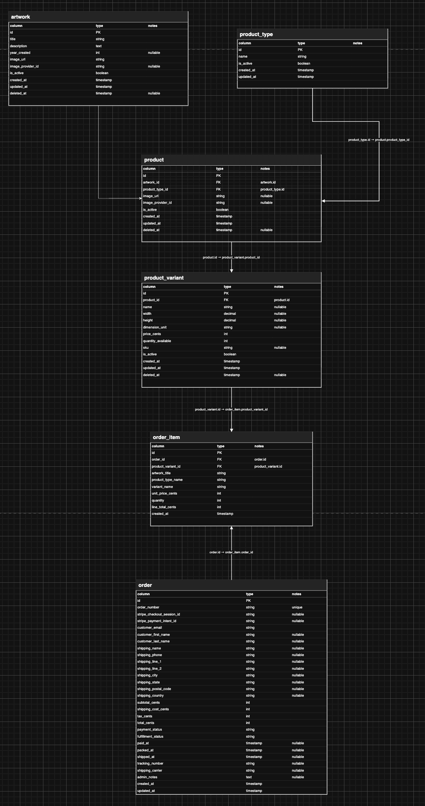
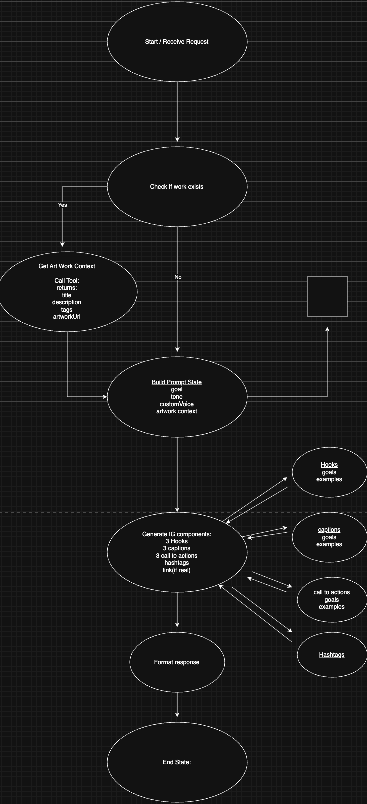

# Art Shop — Full-stack gallery, admin & AI content assistant

Full-stack web application for an independent artist: a **public product gallery** tied to **artworks**, a **password-protected admin** area for catalog management, and a **LangGraph + Ollama assistant** for **Instagram-style copy** (hooks, captions, CTAs, hashtags).

*Academic project — Vue 3 + Express + MongoDB.*

---

## Highlights

- **Public site** — Browse artworks and products by slug; product detail with imagery and metadata.
- **Admin workspace** — Session-based authentication; CRUD for artworks, product types, products, and images; soft-delete and visibility toggles.
- **Catalog bundle API** — Single endpoint to create a coherent listing (artwork + product + related data) in one request.
- **AI-assisted captions** — LangGraph workflow: normalize input, inject user-“hearted” example lines (in-memory), call Ollama, **validate** structured JSON with **Zod**, retry on recoverable failures.

---

## Tech stack

| Layer | Technologies |
|--------|----------------|
| Frontend | Vue 3, Vue Router, Vite |
| Backend | Node.js, Express 5 |
| Data | MongoDB, Mongoose |
| Auth | express-session (cookie), salted password hashing (Node `crypto` / scrypt) |
| AI | LangGraph, LangChain tools, Ollama client, Zod |

---

## Getting started

**Prerequisites:** Node.js, MongoDB, and for AI features an **Ollama** runtime reachable from the server (defaults are overridable via environment variables).

1. Clone the repo and install dependencies:

   ```bash
   npm install
   ```

2. Configure environment variables (e.g. `.env`): **MongoDB connection string**, **session secret**, and optionally **`OLLAMA_HOST`** / **`OLLAMA_MODEL`** to match your machine.

3. Run services:

   | Command | Purpose |
   |---------|---------|
   | `npm run server` | API only (`server/server.js`) |
   | `npm run dev` | Vite dev server (frontend) |
   | `npm run dev:all` | API + frontend concurrently |
   | `npm run build` | Production build of the Vue app |

---

## Domain model

- **Artwork** — Title, URL slug, description, optional year, visibility, soft-delete (hidden rather than destroyed).
- **Product type** — Category of sellable item (e.g. poster): materials, feature bullets, metadata.
- **Product** — Sellable SKU linking one artwork to one type: price (stored in cents), inventory, size fields, images, visibility, soft-delete.
- **Product image** — Image URL, sort order, primary flag, alt text.
- **Admin user** — Username and password hash for back-office access.
- **Preferred copy (AI)** — Up to five “liked” hooks, captions, and CTAs per category, stored **in server memory** to steer generation; cleared on process restart (not persisted in MongoDB).

---

## API overview

All routes under **`/api/admin/*`** except session login require an authenticated session (session cookie).

### Public (no login)

| Method | Route | Description |
|--------|--------|-------------|
| `GET` | `/api/artworks` | List artworks on the site |
| `GET` | `/api/artworks/:slug` | Single artwork |
| `GET` | `/api/products` | Product gallery |
| `GET` | `/api/product/:slug` | Single product |

### Session

| Method | Route | Description |
|--------|--------|-------------|
| `POST` | `/api/admin/session/login` | Login (username + password) |
| `GET` | `/api/admin/session` | Current session |
| `POST` | `/api/admin/session/logout` | Logout |

### Admin — resources

| Area | Notable endpoints |
|------|-------------------|
| Artworks | `GET/POST /api/admin/artworks`, `GET/PUT/DELETE .../:id`, `PATCH .../:id/toggle-active` |
| Product types | `GET/POST /api/admin/product-types`, `GET/PUT .../:id` |
| Products | `GET/POST /api/admin/products`, `GET/PUT .../:id`, `GET .../:productId/images`, `PUT .../images/:imageId/primary`, `PUT .../inventory` |
| Product images | `POST /api/admin/product-images`, `PUT/DELETE .../:id` |
| Catalog bundle | `POST /api/admin/catalog-items` — create listing bundle in one shot |

### Admin — Instagram helper

| Method | Route | Description |
|--------|--------|-------------|
| `POST` | `/api/admin/ai/generate-ig` | Body: artwork description + optional voice / tone / focus; returns hooks, captions, CTAs, hashtags |
| `POST` | `/api/admin/ai/save-preferred` | Save a “hearted” line for future prompt conditioning |

---

## Database (high level)



Models live under **`server/models/`**. In short:

- **Artworks** — Title, unique slug, description, optional year, active flag, optional `deletedAt`, timestamps.
- **Product types** — Name, unique slug, optional description, features, material, active flag, timestamps.
- **Products** — Reference artwork + type, unique slug, price (cents), stock, optional size fields, active + `deletedAt`, timestamps; images in a separate collection.
- **Product images** — Reference product, URL, ordering, primary flag, alt text, active + `deletedAt`, timestamps.
- **Admin users** — Username, password hash, enabled / admin flags, timestamps.

---

## Instagram AI pipeline

Administrators describe a piece in plain language (and optional stylistic constraints). The server:

1. Normalizes context and loads saved preferred examples from memory.
2. Builds a single structured prompt and calls **Ollama** once per attempt (via LangChain tools invoked by the graph — not model-selected tool use).
3. Parses the reply as JSON and enforces shape with **Zod** (fixed counts for hooks, captions, CTAs, hashtags).
4. Retries up to a small cap when the failure is a recoverable parse/validation issue.



Implementation reference: **`server/ai/`** (graph, tools, Zod schemas, in-memory preferences) and **`server/routes/aiIg.js`**.

---

## Repository

[github.com/michael-d-abraham/artist-portfolio-store](https://github.com/michael-d-abraham/artist-portfolio-store)
