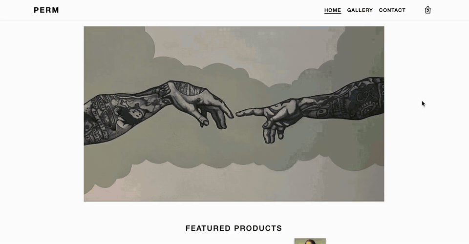
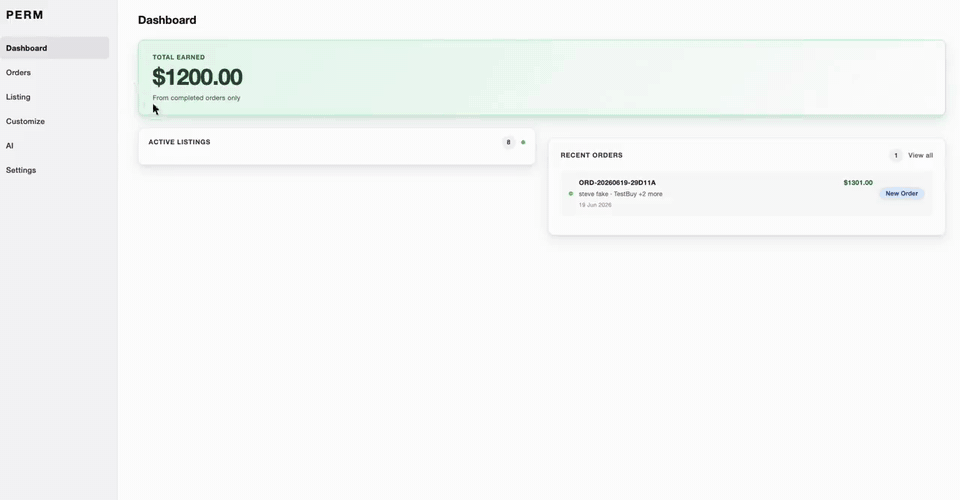
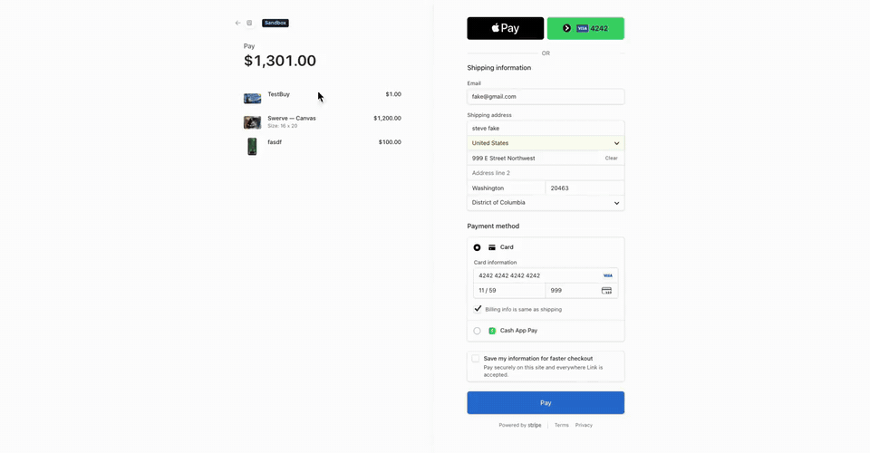
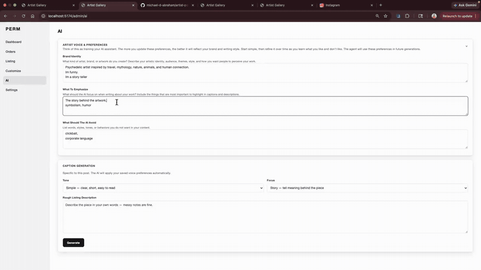
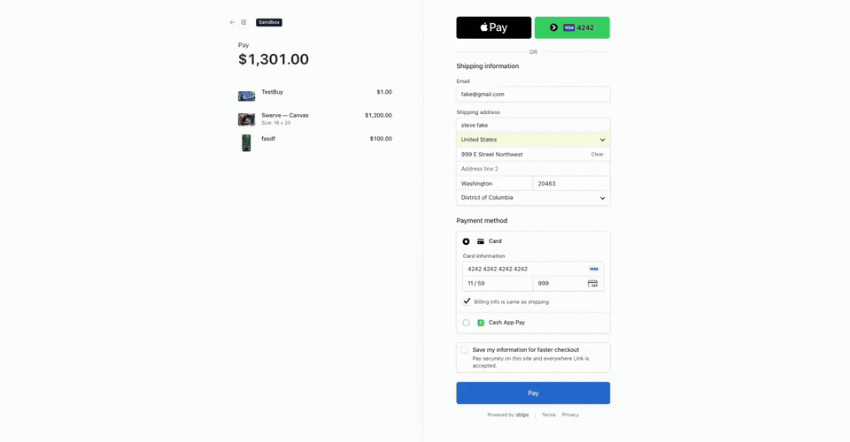

# Artist Portfolio Store

**A full-stack e-commerce platform for artists and creators.**

**Live Site:** https://artist-portfolio-store.onrender.com

> Hosted on Render. First load after idle may take ~20 seconds while the server spins up.

Originally built for my brother's artwork, this project evolved into a reusable platform that combines an online storefront, business management tools, and an AI-powered marketing assistant in a single application.

### Features

- Sell artwork through Stripe Checkout
- Manage products, inventory, and orders
- Customize site content through an admin portal
- Generate brand-aware social media content with AI

### Highlights

- Full-stack e-commerce platform built from scratch
- Custom CMS and admin dashboard
- AI marketing assistant using LangGraph and Ollama
- Cloudflare R2 image management
- Responsive design for desktop and mobile
- Reusable architecture for artists and small businesses

### Tech Stack

Vue 3 · Node.js · Express · MongoDB · Stripe · Cloudflare R2 · LangGraph · Ollama

---

## Demo videos

Walkthroughs of the live product — storefront, admin, checkout flow, AI agent, and customization.

### 1. Storefront & Stripe checkout

A quick tour of the public site: browsing the gallery, viewing product detail, adding to cart, and completing payment through **Stripe Checkout**. Prices and inventory always come from the server — the browser never controls what gets charged.



### 2. Admin dashboard

Overview of the private admin workspace: earnings, active listings, recent orders, and how the layout responds on different screen sizes. Everything the owner needs to run the shop lives here — no separate tools required.



### 3. Successful purchase → admin update

End-to-end proof that commerce is wired up: a customer completes checkout, the **dashboard updates** with the new order, **inventory decrements**, and the **store owner receives an email** notification. One purchase triggers the full backend pipeline.



### 4. AI agentic caption flow

The built-in marketing assistant in action. This is not a single prompt → text box — it is a **LangGraph agent** that calls tools to load the artist's saved voice profile and hearted examples, generates structured output (hooks, captions, CTAs, hashtags), and validates the response with **Zod** before returning it. The model decides when to fetch context; the app decides when output is valid.



**What makes this impressive technically**

* Tool-calling loop — agent invokes `get_artist_voice_profile` and `fetch_preferred_copy_examples` at runtime
* Brand preferences persist in MongoDB and improve over time as the artist hearts lines they like
* Structured JSON output with a repair loop (up to 3 retries) if validation fails
* Runs against a local **Ollama** model via LangChain — no hard-coded copy templates

### 5. Customize the front face (no code)

Every major section of the public site — home hero, featured work, about copy, contact page labels, social links, and images — can be changed from **Admin → Customize**. Upload new photos, edit text, pick featured products, and preview changes without touching the codebase.



---

## Technical overview

The sections below are for developers who want to understand how the code is organized and what matters under the hood.

### Project structure

```
frontend/src/          Vue 3 SPA — public pages + admin workspace
server/
  ai/                  LangGraph agent, tools, Zod schemas
  models/              Mongoose schemas
  routes/              Express route handlers
  services/            Checkout, orders, dashboard, site settings, R2
  middleware/          Admin auth, image upload
tests/                 Jest + Supertest + mongodb-memory-server
images/                Demo walkthrough videos (see above)
```

Production serves the built Vue app from Express (`npm run build` → `frontend/dist`).

### Quick start

```bash
npm install
cp .env.example .env   # fill in MongoDB, Stripe, R2, admin credentials, etc.
npm run dev:all        # API :3000 + Vite :5173
```

| Command | Purpose |
|---------|---------|
| `npm run dev:all` | Run API + frontend together |
| `npm run build` | Production frontend build |
| `npm start` | Production server |
| `npm test` | Jest test suite |

Admin login: `/admin/login` (not linked from the public site). Set `ADMIN_USERNAME` and `ADMIN_PASSWORD` in `.env` — synced to MongoDB on server start.

### Core backend patterns

**Server-authoritative commerce**
- Cart and checkout send only `{ product_id, quantity }` — prices and stock are always loaded from MongoDB at checkout time
- Stripe line items built from database records, not client input

**Idempotent order fulfillment**
- Paid orders recorded via Stripe webhook and/or the order-success API — both call the same pipeline
- Deduped on `stripe_checkout_session_id`
- MongoDB transactions atomically create Order + OrderItem snapshots and decrement inventory

**Sessions**
- `express-session` with MongoDB store (`connect-mongo`) — admin auth and cart persist across restarts (important on Render)

**Images**
- Admin uploads go to Cloudflare R2 via the AWS S3 SDK (`POST /api/admin/upload-image`)
- In-browser crop/rotate/flip before upload (Cropper.js)

**Site CMS**
- Home page, contact page, and social links stored in a single `SiteSettings` document — editable from Admin → Customize without redeploying

### AI pipeline (`server/ai/`)

| Piece | Role |
|-------|------|
| `igGenerationGraph.js` | LangGraph state machine — agent ↔ tools ↔ validate ↔ repair loop |
| `igTools.js` | `get_artist_voice_profile`, `fetch_preferred_copy_examples` |
| `modelProvider.js` | ChatOllama + `.bindTools()` |
| `schemas.js` | Zod for HTTP bodies and model output (3 hooks, 3 captions, 3 CTAs, 10 hashtags) |
| `preferredExamplesStore.js` | Hearted lines in MongoDB — FIFO, max 5 active per type |

The LLM decides when to call tools. Voice profile and preferred examples are **not** passed in the generate request — the agent fetches them at runtime. Successful runs are logged to `AiGeneration`.

Requires Ollama (`OLLAMA_HOST`, `OLLAMA_MODEL` in `.env`).

### Data models (MongoDB)

| Model | Purpose |
|-------|---------|
| `Product` / `ProductImage` | Catalog, multi-image, soft-delete, Stripe IDs |
| `Order` / `OrderItem` | Paid checkout with fulfillment status + purchase-time snapshots |
| `SiteSettings` | CMS for home, contact, social |
| `AiVoiceProfile` | Brand identity, emphasize, avoid |
| `AiPreferredExample` | Hearted hooks, captions, CTAs |
| `AdminUser` | Scrypt-hashed credentials |

Order fulfillment statuses: `new_order` → `shipped` → `completed` → `cancelled`.

### API surface (summary)

**Public:** `GET /api/products`, `GET /api/product/:slug`, `POST /api/checkout/create-session`, `POST /api/webhooks/stripe`, `POST /api/contact`, `GET /api/orders/checkout-session/:sessionId`

**Admin** (session required): products CRUD, image upload, dashboard, orders + fulfillment status, site settings, AI generate / voice profile / save-preferred

### Environment variables

See `.env.example`. Minimum to run locally:

- **Core:** `MONGO_STRING`, `SESSION_SECRET`, `CLIENT_URL`
- **Admin:** `ADMIN_USERNAME`, `ADMIN_PASSWORD`
- **Stripe:** `STRIPE_SECRET_KEY`, `STRIPE_WEBHOOK_SECRET`
- **Images:** `R2_*` (all five vars)
- **Contact:** `RESEND_API_KEY`
- **AI:** `OLLAMA_HOST`, `OLLAMA_MODEL`

Local Stripe webhooks: `stripe listen --forward-to localhost:3000/api/webhooks/stripe`

### Tests

Jest suites cover checkout validation, Stripe webhook idempotency, order-success recording, cart behavior, and AI schemas/persistence/auth guards. AI graph is mocked in tests (LangGraph ESM dependency).

---

## Repository

[github.com/michael-d-abraham/artist-portfolio-store](https://github.com/michael-d-abraham/artist-portfolio-store)
